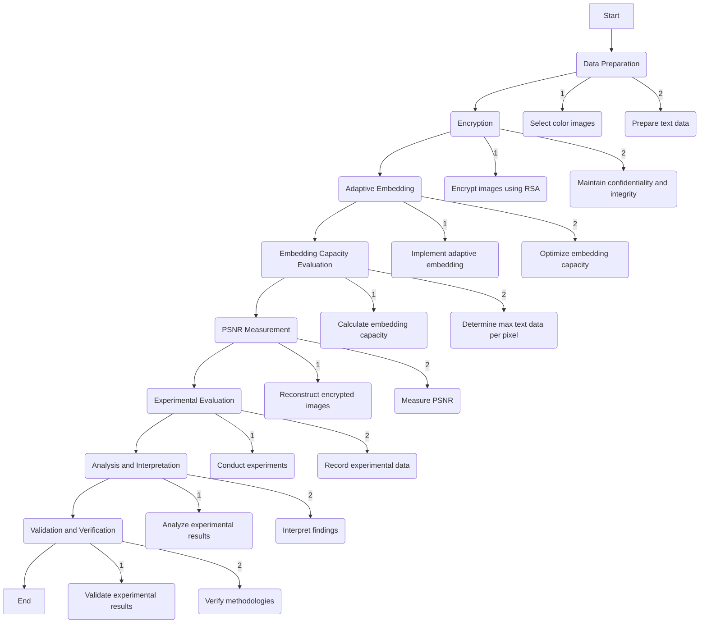
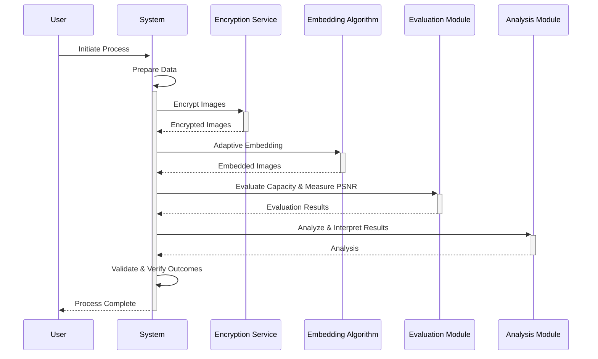
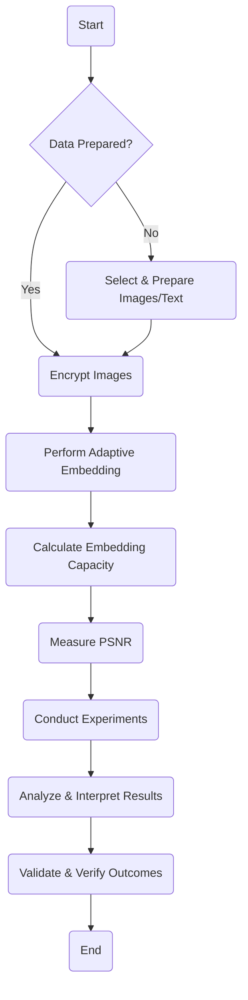

# process mapping

## Flow Diagram

```mermaid
graph TD
    A[Start] --> B(Data Preparation)
    B --> C(Encryption)
    C --> D(Adaptive Embedding)
    D --> E(Embedding Capacity Evaluation)
    E --> F(PSNR Measurement)
    F --> G(Experimental Evaluation)
    G --> H(Analysis and Interpretation)
    H --> I(Validation and Verification)
    I --> J[End]

    B --> |1| B1(Select color images)
    B --> |2| B2(Prepare text data)

    C --> |1| C1(Encrypt images using RSA)
    C --> |2| C2(Maintain confidentiality and integrity)

    D --> |1| D1(Implement adaptive embedding)
    D --> |2| D2(Optimize embedding capacity)

    E --> |1| E1(Calculate embedding capacity)
    E --> |2| E2(Determine max text data per pixel)

    F --> |1| F1(Reconstruct encrypted images)
    F --> |2| F2(Measure PSNR)

    G --> |1| G1(Conduct experiments)
    G --> |2| G2(Record experimental data)

    H --> |1| H1(Analyze experimental results)
    H --> |2| H2(Interpret findings)

    I --> |1| I1(Validate experimental results)
    I --> |2| I2(Verify methodologies)
```

## Sequence Diagram

```mermaid
sequenceDiagram
    participant User
    participant System
    participant EncryptionService as Encryption Service
    participant EmbeddingAlgorithm as Embedding Algorithm
    participant EvaluationModule as Evaluation Module
    participant AnalysisModule as Analysis Module

    User->>+System: Initiate Process
    System->>+System: Prepare Data
    System->>+EncryptionService: Encrypt Images
    EncryptionService-->>-System: Encrypted Images
    System->>+EmbeddingAlgorithm: Adaptive Embedding
    EmbeddingAlgorithm-->>-System: Embedded Images
    System->>+EvaluationModule: Evaluate Capacity & Measure PSNR
    EvaluationModule-->>-System: Evaluation Results
    System->>+AnalysisModule: Analyze & Interpret Results
    AnalysisModule-->>-System: Analysis
    System->>System: Validate & Verify Outcomes
    System-->>-User: Process Complete
```

## Flow Diagram 2

```mermaid
graph TD
    A(Start) --> B{Data Prepared?}
    B -->|No| C(Select & Prepare Images/Text)
    B -->|Yes| D(Encrypt Images)
    C --> D
    D --> E(Perform Adaptive Embedding)
    E --> F(Calculate Embedding Capacity)
    F --> G(Measure PSNR)
    G --> H(Conduct Experiments)
    H --> I(Analyze & Interpret Results)
    I --> J(Validate & Verify Outcomes)
    J --> K(End)
```
